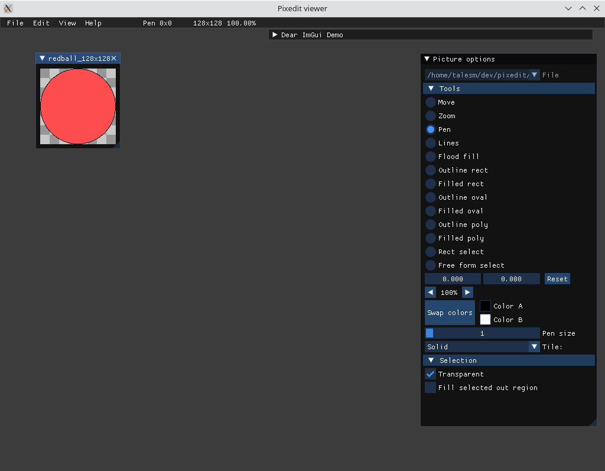

PixEdit
=======

A simple and customizable pixel art focused image editor



Goals
-----

- Focused on pixel editing
- Multiple formats
- Animation support
- Customizable
- Free and open source

See [roadmap](roadmap.md) for how we plan to do this.


License
-------

We use [GPL 2 License](LICENCE.md).

Build
-----

To build, make sure you have SDL2 and SDL2_image installed and visible on path. Then run `make`, with desired options. We suggest:

```shell
$ make -j 10 OPTIMIZE=1 DEBUG=0
```

If successful, the executable can be found as build/pixedit.

Credits
-------

- It links [SDL](libsdl.org/) and its companion SDL_image for Window and Video
  capabilities, which are zlib licensed;
- It uses the source code of
  [TinyfileDialogs](http://tinyfiledialogs.sourceforge.net) found as
  `external/tinyfiledialogs.*`, which is zlib licensed;
- It uses the source code of [Dear ImGui](https://github.com/ocornut/imgui)
  under the `external/imgui` directory, which is MIT licensed.
- I based some of the primitive drawing code on [SDL_gfx](https://www.ferzkopp.net/wordpress/2016/01/02/sdl_gfx-sdl2_gfx/)'s 
  code, with adaptations in order to fit our purpose. That code can been find
  on utils/raster*.hpp files.
